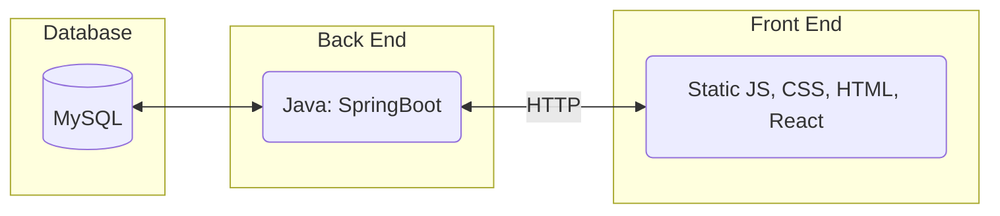
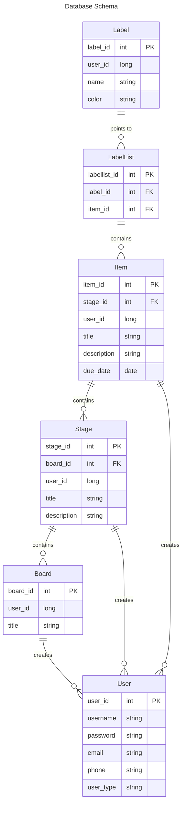

# Project_04

## Tango Masters
<!--The name of your team.-->
### Project Abstract
<!--A one paragraph summary of what the software will do.-->

**Task Tango** is a user-friendly project management tool designed to streamline task tracking
and collaboration through customizable *Kanban boards*. Users can create multiple Kanban boards
with custom columns that fit the unique workflows of their projects or teams. Each board allows
for seamless task management, including creating, editing, and moving tasks between different
stages of progress. Key features of Task Tango include the ability to duplicate boards,
copy-paste tasks, and share boards with other users while assigning specific permissions
such as viewer, editor, or admin. Task Tango empowers teams to stay organized and collaborate
efficiently on their projects.

### Customer
<!--A brief description of the customer for this software, both in general (the
population who might eventually use such a system) and specifically for this
document (the customer(s) who informed this document). Every project will have a
customer from the CS506 instructional staff. Requirements should not be derived
simply from discussion among team members. Ideally your customer should not only
talk to you about requirements but also be excited later in the semester to use the
system. For now, since we do not have a customer from the CS506 staff, a general one
is included.-->

The target customers for Task Tango include individuals and teams across various industries
who need a flexible and intuitive project management tool. These users could range from small
 business owners and freelancers to larger teams in corporate environments, all seeking to
organize tasks, manage workflows, and collaborate effectively. Task Tango is designed to cater
to both personal and professional project management needs, making it an ideal solution for
anyone looking to improve task tracking and team communication.

### Specification
<!--A detailed specification of the system. UML, or other diagrams, such as finite
automata, or other appropriate specification formalisms, are encouraged over
natural language.-->
<!--Include sections, for example, illustrating the database architecture (with,
for example, an ERD).-->
<!--Included below are some sample diagrams, including some example tech stack
diagrams.-->

#### Technology Stack

Our Technology Stack includes the following:

#### Database Schema

### Standards & Conventions
<!--This is a link to a seperate coding conventions document / style guide-->
[Style Guide & Conventions](STYLE.md)

